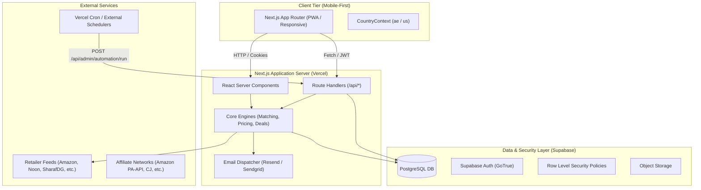

# CatchThePrice — System Architecture & Design

This document details the core architectural layers, database models, security rules, and processing engines powering **CatchThePrice** (`catchtheprice.com`).

---

## 1. System Overview

CatchThePrice is an AI-assisted price-intelligence and deal discovery platform designed for high-concurrency mobile shopping. It provides:
- Multi-retailer price comparison and historical price tracking.
- Rules-first algorithmic deal scoring (0–100).
- User account and retention loops (watchlists, target price alerts, multi-channel notifications).
- Background data automation, identity resolution matching, and exception review queues.
- AdSense-safe monetization slots and secure outbound merchant redirects.

---

## 2. Core Engines

### 2.1 Multi-Stage Product Matching Engine (`lib/matching/`)
Resolves incoming retailer listings to canonical catalog products using a multi-stage confidence model:

1. **Stage 1: Exact Unique Identifier Match** (Confidence: 100%)
   - Matches globally unique GTIN, EAN, UPC, or ISBN.
2. **Stage 2: MPN + Brand Match** (Confidence: 95%)
   - Matches Manufacturer Part Number (MPN) when combined with normalized brand identity.
3. **Stage 3: Tokenized & Fuzzy Levenshtein Match** (Confidence: 0–90%)
   - Normalizes titles (strips extraneous noise like "new", "original", packaging variants).
   - Computes Jaccard word-level overlap and Levenshtein string similarity.
4. **Resolution Decision**:
   - `confidence >= 0.90` → `AUTO_ACCEPT` (Auto-linked to canonical product).
   - `0.65 <= confidence < 0.90` → `REVIEW` (Routed to `human_review_queue` at `/admin/review`).
   - `confidence < 0.65` → `REJECT` (Creates new staged product or flags as unmatched).

### 2.2 Price Tracking & Deduplication Engine (`lib/pricing/`)
- Ingests raw retailer price observations.
- Deduplicates identical price points within a 24-hour rolling window to preserve database efficiency while maintaining high fidelity.
- Computes:
  - Rolling 30-day and 90-day price medians.
  - All-time lowest recorded price.
  - Price-drop magnitude (`percentage` and `absolute`).

### 2.3 Rules-First Deal Scoring Engine (`lib/deals/dealEngine.ts`)
Calculates an objective deal score (0–100) based entirely on historical price reality rather than deceptive retailer "list prices":

$$\text{Score} = \min(100, S_{\text{discount}} + S_{\text{historical}} + S_{\text{savings}} + B_{\text{ATL}} + B_{\text{competition}})$$

- **Discount Component (0–35 pts)**: Percentage discount relative to verified retailer baseline.
- **Historical Median Component (0–25 pts)**: Comparison against the product's 90-day median price.
- **Absolute Savings Component (0–20 pts)**: Monetary savings scaled to currency thresholds.
- **All-Time Low Bonus (+15 pts)**: Awarded if the current price matches or breaks the all-time recorded low.
- **Retailer Competition Bonus (+5 pts)**: Awarded when $\ge 3$ distinct retailers compete on the product.

### 2.4 Outbound Merchant Click Tracker (`app/api/outbound/route.ts`)
- Prevents open-redirect vulnerabilities by resolving destinations **strictly by offer ID** in the database.
- Enforces HTTPS protocols.
- Binds destinations to verified merchant domains.
- Records click timestamp, merchant ID, country code, device type, and referrer host for conversion attribution.

---

## 3. Database Schema & Security Model

All tables reside in PostgreSQL with Row Level Security (RLS) enabled.

### 3.1 Customer & Retention Tables
- `profiles`: Extends `auth.users` with display name, avatar, preferred country, currency, and role.
  - RLS: `select, update using (auth.uid() = id)`
- `user_settings`: Notification toggles (price drops, target reached, weekly digests).
  - RLS: `all using (auth.uid() = user_id)`
- `saved_products`: User watchlists and saved product references.
  - RLS: `all using (auth.uid() = user_id)`
- `price_alerts`: Active target price monitors with trigger status and threshold price.
  - RLS: `all using (auth.uid() = user_id)`
- `notifications`: In-app notification center feed with read/unread tracking.
  - RLS: `all using (auth.uid() = user_id)`
- `recently_viewed`: Browsing history synced between client storage and account.
  - RLS: `all using (auth.uid() = user_id)`

### 3.2 Automation & Catalog Tables
- `brands`: Master brand registry.
- `product_variants`: Canonical product representations across colors, storage, and models.
- `product_identifiers`: Registry of EANs, UPCs, MPNs, and ASINs for identity resolution.
- `deals`: Materialized scored deals with algorithmically computed scores and timestamps.
- `automation_jobs`: Registry of all 12 system jobs with schedules and status.
- `automation_runs`: Execution logs containing duration, items processed, errors, and run parameters.
- `human_review_queue`: Exception queue for manual intervention (low-confidence matches, job failures, price anomalies).
- `audit_logs`: Immutable audit log of administrative actions.

> [!IMPORTANT]
> All back-office tables (`automation_jobs`, `automation_runs`, `human_review_queue`, `audit_logs`) have public access revoked (`revoke all from anon, authenticated`). Only trusted server-side procedures using `SUPABASE_SERVICE_ROLE_KEY` or admin endpoints can query them.

---

## 4. Localized Routing & Internationalization

CatchThePrice implements locale-first dynamic routing:
- `/[country]` (`/ae`, `/us`): Localized homepage, product catalog, search, and comparisons.
- `/[country]/account/*`: Customer account area.
- `/[country]/login`, `/[country]/signup`: Localized authentication flows preserving user country context.
- Country configuration is defined in `lib/data/countries.ts` with strict ISO codes, currencies (`AED`, `USD`), and flags.
