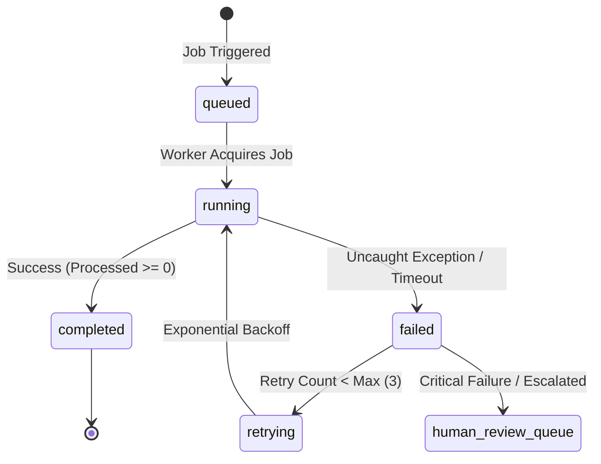

# CatchThePrice — Background Automation & Job Engine

This document details the automated background pipelines, job lifecycles, and exception management for **CatchThePrice** (`catchtheprice.com`).

---

## 1. Automation Job Registry

The platform defines 12 core background automation jobs (`lib/automation/jobRunner.server.ts`):

| Job Type | Schedule | Priority | Description |
| :--- | :--- | :--- | :--- |
| `FETCH_FEEDS` | Every 4h | High | Ingests raw retailer catalog and price feeds across verified merchant sources. |
| `MATCH_PRODUCTS` | Every 4h | High | Multi-stage identity resolution linking incoming listings to canonical products. |
| `CHECK_PRICES` | Every 1h | Critical | Evaluates retailer price freshness, detects price drops, and updates active offers. |
| `DETECT_DEALS` | Every 2h | High | Runs the deal scoring algorithm (0–100) across all catalog products. |
| `CLEAN_DATA` | Daily (02:00) | Medium | Normalizes titles, strips junk keywords, and purges stale listings. |
| `CALCULATE_METRICS` | Daily (03:00) | Medium | Recalculates 30d/90d historical medians and merchant price competitiveness. |
| `SEND_ALERTS` | Every 15m | Critical | Scans active user target-price alerts and dispatches price-drop emails and in-app notifications. |
| `GENERATE_CONTENT` | Daily (04:00) | Low | Analyzes real user search analytics to discover unmet high-intent shopping queries. |
| `VALIDATE_AFFILIATES`| Weekly | Medium | Verifies outbound destination health, HTTP status, and affiliate tag integrity. |
| `BACKUP_SNAPSHOT` | Daily (01:00) | Low | Exports daily price point snapshots and metric tables for long-term historical analysis. |
| `REFRESH_CATALOG` | Every 6h | High | Rebuilds search indices and updates product summary materializations. |
| `MONITOR_HEALTH` | Every 5m | Critical | Checks database latency, email provider connectivity, and error rates. |

---

## 2. Execution Lifecycle & State Machine

Each job execution follows a deterministic state progression recorded in `automation_runs`:



### Run Log & Metrics
Each execution record stores:
- `job_type`: Enumerated job identifier.
- `status`: `queued` | `running` | `completed` | `failed` | `retrying`.
- `items_processed`: Number of entities successfully evaluated or updated.
- `items_failed`: Number of items that encountered processing errors.
- `started_at` & `finished_at`: Exact execution timestamps.
- `error_details`: Stack traces or error descriptions if an error occurred.
- `run_log`: Diagnostic JSON payload with configuration parameters.

---

## 3. Human Review & Exception Routing

When automated routines encounter ambiguous or exceptional data, they route tasks to the `human_review_queue` table rather than failing silently or corrupting the canonical catalog:

### Exception Categories
1. **`PRODUCT_MATCHING`**: Incoming retailer listing has a matching confidence between 65% and 89%. Operators review title, image, brand, and specs side-by-side to either link or separate the product.
2. **`AUTOMATION_FAILURES`**: Any background job that exhausts retries or encounters critical runtime exceptions.
3. **`PRICE_ANOMALY`**: Price changes exceeding ±75% in a single update (guards against retailer pricing glitches or scrapers reading erroneous currencies).
4. **`MERCHANT_ANOMALIES`**: High bounce rates, broken landing pages, or invalid outbound affiliate parameters.

### Admin Review Interface
Operators manage exceptions directly at `/admin/review`:
- **Queue Filtering**: Filter by queue type, priority (`critical`, `high`, `medium`, `low`), or status (`PENDING`, `APPROVED`, `REJECTED`).
- **One-Click Resolution**: Approve matches, reject suspicious price drops, or dismiss resolved job alerts.
- **Audit Logging**: Every manual resolution records an entry in `audit_logs` tracking the operator's email, action, and timestamp.

---

## 4. Triggering Automation Jobs

### Via Admin UI
1. Navigate to `/admin/automation`.
2. Click **"Run Now"** next to any of the 12 registered jobs.
3. Observe live execution status, items processed, and updated run logs in the execution history table.

### Via Authenticated API Endpoint
```bash
curl -X POST https://catchtheprice.com/api/admin/automation/run \
  -H "Content-Type: application/json" \
  -H "Cookie: <ADMIN_SESSION_COOKIE>" \
  -d '{"jobType": "DETECT_DEALS", "config": { "country": "ae" }}'
```

### Via Scheduled Cron
Vercel Cron or an external cron worker calls:
```bash
curl -X GET https://catchtheprice.com/api/cron/alerts \
  -H "Authorization: Bearer <CRON_SECRET>"
```
